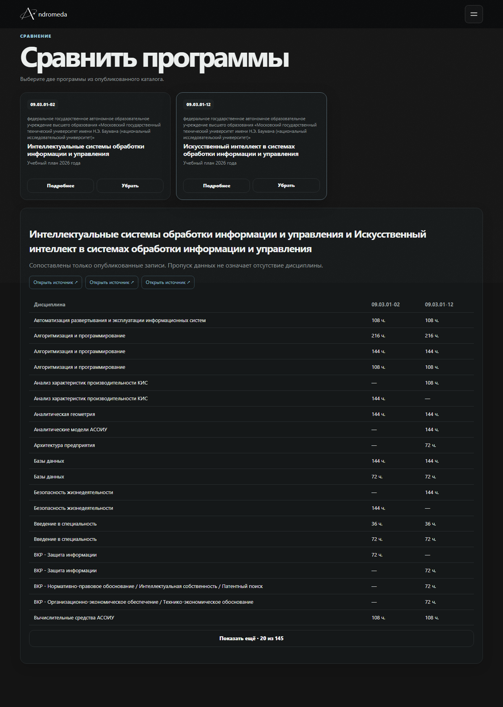
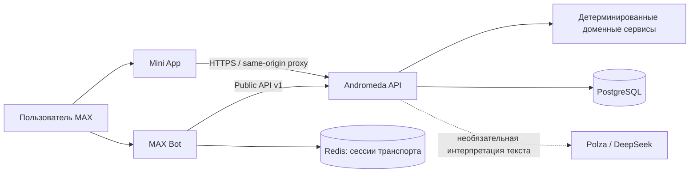

# Andromeda — каталог и помощник по поступлению

Andromeda помогает изучать опубликованные программы и учебные планы, сравнивать направления и разбираться в условиях приёма. Открыть каталог можно в MAX Mini App; вопросы можно задавать MAX-боту обычным текстом.

## Готовность и воспроизводимость

- **Материалы соответствуют версии решения:** код, контракты API, Docker Compose и инструкции хранятся вместе; точную версию фиксирует Git commit (`git rev-parse HEAD`).
- **Запуск воспроизводим:** локальный стек описан одной командой Docker Compose после заполнения `.env`.
- **Описаны архитектура, зависимости, окружение и интеграции:** см. разделы ниже и документацию компонентов.
- **Есть проверяемый основной сценарий:** запуск бота → `/start` → пример сравнения → ответ и PDF со сравнением.
- **Ограничения зафиксированы:** показываются только данные каталога и опубликованных источников; покрытие зависит от наполнения и доступности данных, а ответы ИИ не заменяют расчёты backend.

## Содержание

- [Возможности](#возможности)
- [Архитектура](#архитектура)
- [Быстрый запуск через Docker](#быстрый-запуск-через-docker)
- [Настройка MAX и ИИ](#настройка-max-и-ии)
- [Проверка основного сценария](#проверка-основного-сценария)
- [Проверка API и Mini App](#проверка-api-и-mini-app)
- [Разработка и тесты](#разработка-и-тесты)
- [Ограничения](#ограничения)
- [Структура и документация](#структура-и-документация)
- [Лицензии](#лицензии)

## Возможности

- каталог опубликованных образовательных программ;
- просмотр доступных дисциплин, учебных планов и условий приёма;
- сравнение программ по учебным планам с отправкой PDF в чат;
- диалог с уточнениями: можно отвечать обычным текстом;
- Mini App с каталогом и карточками программ, учебными планами, сравнением 2–4 программ, проверкой поступления, профилем, shortlist, ПрофТестом, рекомендациями, новостями и правилами;
- backend API с OpenAPI-контрактом.

Каталог программ загружается из Public API v1 без демонстрационных записей. У других экранов разные источники и ограничения: часть данных приходит из API, часть состояния сохраняется только в браузере. Они описаны в [`apps/max/README.md`](apps/max/README.md).



## Архитектура



MAX-адаптер обращается к backend через HTTP Public API v1. Решения и вычисления принадлежат backend; провайдер ИИ может помочь разобрать формулировку, но не создаёт учебные планы, источники или результаты. Спецификация API: [`services/andromeda/openapi.json`](services/andromeda/openapi.json).

## Быстрый запуск через Docker

### Требования

- Docker Desktop или Docker Engine с Docker Compose v2;
- токен MAX-бота, выданный для вашего бота;
- доступ к реестрам контейнеров при первой сборке (образы Node.js и Python скачиваются автоматически).

### 1. Получите проект и создайте локальное окружение

```powershell
git clone https://github.com/artemnoor/hackathon-max-andromeda.git
cd hackathon-max-andromeda
Copy-Item .env.example .env
notepad .env
```

В `.env` задайте `MAX_BOT_TOKEN` значением токена вашего бота. Не отправляйте токен в чат, GitHub или коммиты. Инструкция по настройке других интеграций приведена ниже.

### 2. Соберите и запустите весь стек

Из корня репозитория выполните одну команду:

```powershell
docker compose --profile max up --build --wait
```

Compose поднимет PostgreSQL, заполнит его fixture-данными для локального запуска, запустит Andromeda API, Redis, MAX-бота и Mini App. При первом запуске Docker должен скачать базовые образы и собрать приложения; время зависит от сети.

Проверить сервисы можно командой:

```powershell
docker compose --profile max ps
```

Mini App откроется на <http://127.0.0.1:8787/>. Локальный API доступен на <http://127.0.0.1:8020/>; проверка готовности — `/health/ready`, схема — `/openapi.json`.

Остановить приложения, сохранив локальную базу и кэш:

```powershell
docker compose --profile max down
```

Чтобы также удалить сохранённые локальные данные, используйте `docker compose --profile max down --volumes`.

## Настройка MAX и ИИ

Все значения вводятся в корневой файл `.env`, созданный из `.env.example`.

| Переменная | Обязательна | Где получить / что указать |
|---|:---:|---|
| `MAX_BOT_TOKEN` | Да, для бота | Токен MAX-бота. Сохраните его только в локальном `.env` или хранилище секретов хостинга. |
| `POLZA_AI_API_KEY` | Нет | Ключ Polza AI. Без него остаётся детерминированная обработка backend. |
| `PRESENTATION_LLM_ENABLED` | Нет | В `.env.example` включена обработка естественного языка; без ключа провайдера backend использует fallback. |
| `MINI_APP_PUBLIC_URL` | Для внешнего MAX Mini App | Публичный HTTPS-адрес Mini App; локальный `127.0.0.1` MAX-клиентам недоступен. |
| `MINI_APP_ORIGINS` | Для внешнего запуска | Точные разрешённые origin, включая origin публичного Mini App. Не используйте `*`. |
| `ANDROMEDA_HOST_PORT` | Нет | Локальный порт API; по умолчанию `8020`. |
| `MINI_APP_PORT` | Нет | Локальный порт Mini App; по умолчанию `8787`. |

Для реального открытия Mini App из MAX настройте публичный HTTPS ingress, укажите тот же origin в `MINI_APP_PUBLIC_URL` и `MINI_APP_ORIGINS`. Docker Compose — локальный стек, не production-публикация. Развёртывание в Yandex Cloud описано в [`services/andromeda/deploy/yc/README.md`](services/andromeda/deploy/yc/README.md) и [`apps/max/docs/deployment.md`](apps/max/docs/deployment.md).

## Проверка основного сценария

1. Запустите стек и убедитесь, что `docker compose --profile max ps` показывает работающие сервисы.
2. Откройте чат с вашим MAX-ботом и отправьте `/start`.
3. Нажмите предложенный `/start` пример сравнения ИУ5 и ИУ7 либо отправьте этот запрос текстом. Если бот попросит уточнение, выберите вариант или ответьте обычным текстом.
4. Дождитесь ответа с названиями сравниваемых программ и PDF-файла сравнения.
5. Откройте PDF и проверьте, что таблица и источники относятся к выбранным программам.

Ожидаемый результат для завершённого запроса на сравнение: бот возвращает данные API и прикладывает PDF. Если программа не определена однозначно, бот уточняет выбор; если нужной программы или источника нет в каталоге, он сообщает о нехватке данных.

## Проверка API и Mini App

```powershell
Invoke-RestMethod http://127.0.0.1:8020/health/ready
Invoke-RestMethod http://127.0.0.1:8020/api/v1/programs
```

Для локальной проверки каталога откройте <http://127.0.0.1:8787/> при запущенном backend. Публичные данные каталога доступны и в браузерном preview. Запросы к персональным данным требуют подписанных launch-данных MAX, поэтому локальный адрес не имитирует авторизованную сессию MAX.

## Разработка и тесты

Mini App написан на JavaScript и собирается Vite; HTTP-хост приложения работает на Node.js и TypeScript. Метка `powershell` у блоков ниже обозначает оболочку для команд Windows, а не язык реализации Mini App.

Локальные проверки без Docker:

```powershell
python scripts/monorepo.py max
python scripts/monorepo.py andromeda
python scripts/monorepo.py contracts
python scripts/monorepo.py full
python scripts/monorepo.py e2e
```

`e2e` использует изолированный fixture-стек и не обращается к MAX или платным AI-провайдерам. Настройка тестов и описание проверок: [`docs/development.md`](docs/development.md), [`apps/max/docs/development.md`](apps/max/docs/development.md), [`services/andromeda/docs/testing.md`](services/andromeda/docs/testing.md). Сводка ручной проверки бота: [`docs/qa/max-bot-live-verification-2026-09-30.md`](docs/qa/max-bot-live-verification-2026-09-30.md).

## Ограничения

- Полнота каталога зависит от опубликованных и загруженных источников. Пропуск дисциплины в источнике не означает, что такой дисциплины нет в реальной программе.
- Fixture-данные нужны для воспроизводимой локальной разработки и не подтверждают покрытие всех вузов и годов.
- Внешний AI-провайдер необязателен и может быть недоступен или отвечать с задержкой; backend должен использовать детерминированный fallback.
- Результат поступления не является гарантией зачисления. Ответ ограничен данными и правилами, доступными системе.
- Локальный MAX webhook/polling и Mini App не подтверждают доступность production-домена или платформы MAX.
- Docker Compose валидируется локально; успешная сборка требует доступного Docker Hub и корректной сетевой конфигурации.

## Структура и документация

| Путь | Назначение |
|---|---|
| [`apps/max/`](apps/max/) | MAX Bot, Mini App, HTTP-клиент Public API и MAX-адаптеры |
| [`services/andromeda/backend/`](services/andromeda/backend/) | API, доменные сервисы, хранилища и ingestion |
| [`services/andromeda/openapi.json`](services/andromeda/openapi.json) | Канонический публичный API-контракт |
| [`compose.yaml`](compose.yaml) | Единый локальный стек Docker Compose |
| [`docs/architecture.md`](docs/architecture.md) | Архитектурные границы и поток данных |
| [`docs/development.md`](docs/development.md) | Разработка, проверки и контракты |
| [`docs/qa/`](docs/qa/) | Сценарии приёмки и наблюдаемые результаты проверки |

## Лицензии

Лицензионные уведомления сохранены в каталогах соответствующих компонентов. Включённые шрифты Noto Sans сопровождаются лицензией в `apps/max/assets/fonts/OFL-Noto-Sans.txt`.
